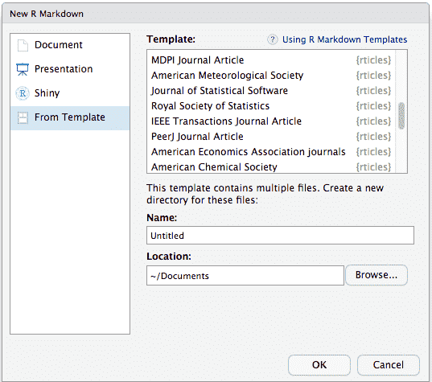

```{r setup, include=FALSE}
knitr::opts_chunk$set(echo = TRUE)
chunk <- "```"
params <- list(this_cut = "Ideal")
```

## RMarkdown files

An RMarkdown file is a plain text file, with some rules and special syntax that allow us to write code and text together.
When it is "knitted," the code will be evaluated and executed and the text formatted so that it creates a reproducible report or document that is nice to read and contains all your work.

This is really critical to reproducibility.
It also saves us time and can help with automation tasks.
This document will recreate the figures for you in the same document where you are writing the text that explain them.
This will save you the effort of doing some analysis, saving a plot on a file, copy-pasting that plot into Word, LaTeX or Power Point or Google Slides, and having to do it all over again after discovering a typo.

Now let's create a new RMarkdown file.
In RStudio you can use the menu bar:

::: instructions
File → New File → R Markdown
:::

A new window will open where you can *optionally* complete with your name, author and the output format.
Let try first HTML.
By doing click on th ok button, the new file will open showing the template.
This is great, you can try to "knit" the file to see the output document.

::: activity
Your turn

1.  Create a new RMarkdown file.
    You can choose the output format.

2.  Knit the document.

3.  Compare the "source file" with the "output file".
    Can you identify the different sections of the file?
:::

### File structure

Any .Rmd file will have 3 sections or areas:


-   The top part uses YAML syntax and includes the title and the output type (which in this case is an HTML document).
-   Below that there are alternating *white* and *grey* sections. These are the two main sections that make up an RMarkdown file: \* Grey sections are code chunks. They are usually R chunks but there are many languages supported. \* White sections are text sections and support markdown for styling.

#### Header

The header is a series of instructions organized between three dashes (`---`) that define the global properties of the document, such as the title, the output format, authorship information, etc..
The heather will contain many many more options when you use templates and customised reports.
You can also change options associated with the output format, such as the style of the table of contents or index.

The YAML format allows you to define hierarchical lists in a humanly readable way.
For example:

``` yaml
---
title: "Mi primer RMarkdown"
output: 
  html_document:
    code_download: true
    toc: true
    toc_float: false
---
```

::: notes
Keep in mind the indentation!

It is very important to maintain the indentation of the elements, since it defines the hierarchy of each element.
Many of the errors you'll find when knitting occur because the file has problems in the header indentation.
:::

#### Code chunks

```{r include=FALSE}
chunk_start <- "```{r label}"
chunk_end <- "```"
```

The R code is written inside code "chunks".
Code chunks start with `` `r chunk_start` `` (where "label" is an optional and unique name) and end with `` `r chunk_end` ``.
Everything you include between these delimiters will be interpreted by R as code and will try to execute it when the file is knitted.
Any output (graphics, tables, text, etc..) will be inserted into the final document in the same order as they are in the R Markdown file.

::: instructions
You can create a new chunk with:

1.  The "+C" green bottom on the top right of the document
2.  A very handy shortcut: `Ctrl + Alt + I`
3.  Writing the \`\`\` by hand (but why would you?)
:::

While the code will run when you knit, if you are analysing data and writing a report it is very convenient to run individual chunks interactively as if it were in the console.

To run the line where your cursor is use the shortcut:

::: instructions
Ctrl + Enter
:::

But you can also run the code of the whole chunk with:

::: instructions
Ctrl + Shift + Enter
:::

By default, the output will appear immediately below the chunk.

#### Text

To format plain text RMarkdown uses Markdown.
You can get a guide to rmarkdown [in this](https://www.rstudio.com/wp-content/uploads/2015/02/rmarkdown-cheatsheet.pdf) cheat sheet, but here is a minimum syntax to get you started:

-   headers start with `#` or `##` and so on (it's important to put a space after the last `#`).
-   bold words and phases are surrounded with `**` or `__`.
-   and italics, with `*` or `_`.

You can also add equations and other symbols with LaTeX in line (`` `$E = mc^2$` ``  looks like $E = mc^2$) or in its own line as:

    $$
    y = \mu + \sum_{i=1}^p \beta_i x_i + \epsilon
    $$

It looks like:

$$
y = \mu + \sum_{i=1}^p \beta_i x_i + \epsilon
$$

::: notes
In-line code

You may find yourself mentioning results in the text, for example something like "the average minimum temperature for the month of March was 18 degrees".
And it is also possible that this value will change if you use a different database or if you then generate a report but for a following month.
The chances of you forgetting to update that "18" are high, that's why RMarkdown also has the possibility to incorporate in-line code.

Let's imagine that you have a variable `temperature` to which you assign the value "18":

    temperature <- 18

To mention it in the text then we have to put the name of that variable between two grave accents and to warn that it is code of R this way r "r"`temperatura` \`\`.
Then if at any time the value of the variable changes, the next time you knit the document it will be updated in the text.
:::

### Chunk control 

You may have notice that the chunks code in the templates includes information between the ```{r }```. We mention the chunk name but we can also add options to control how the chuck will behave when the file is knitted. 
Usually the output will have both code and output, which is fine when you or the person that will read the report wants to see the code that generates those results, but it might not be what the final audience of the report might need. 
It’s up to you to decide if you want to show the code or not.

To change the options of a chunk code, all you have to do is list the options inside the square brackets. For example:

    `r chunk`{r nombre-del-chunk, echo = FALSE, message = FALSE}
    
    `r chunk`

A particularly important set of options are the ones that control whether the code is executed and whether the result of the code will remain in the report or not:

* `eval = FALSE` prevents the chunk code from being run, so it will not display results either. It is useful for displaying example code if you are writing, for example, a document to teach R.

* `echo = FALSE` runs the chunk code and displays the results, but hides the code in the report. This is useful for writing reports for people who do not need to see the R code that generated the graph or table.

* `include = FALSE` runs the code but hides both the code and the results. It is useful to use in general configuration chunks where you load libraries.

If you are writing a report where you don't want any code to be shown, adding `echo = FALSE` to each new chunk becomes tedious. The solution is to change the option globally so that it applies to all chunks. This is done by the `knitr::opts_chunk$set()` function, which sets the global options of the chunks that follow it. You'll find this function on the first "setup" chunk.

    `r chunk`{r setup, include = FALSE}
    knitr::opts_chunk$set(echo = FALSE, 
                      message = FALSE,
                      warning = FALSE)
    `r chunk`
    
::: notes

Figures control

If the output of the chunk is a figure you have a ton of options to control its aspect. From it size, resolution, caption, etc.. 
You can start typing "fig." inside the `{ }` to explore the options.

:::

### Parameterized reports

Sometimes you need to re-do a report changing one variable that repeats over all the code, the best way to do this is through a parameterized report. 

In the following example there is a plot of the price distribution for ideal diamonds. 
If you want to change it to visualise the data for "fair" or "very good" cut diamonds, you will have to change the `filter(cut == "Ideal")` and hopefully you wont forget the plot title. 

```{r message=FALSE, warning=FALSE}
library(dplyr)
library(ggplot2)

diamonds %>% 
  filter(cut == "Ideal") %>% 
  ggplot(aes(color, price)) +
  geom_boxplot() +
  labs(title = "Price distribution for ideal diamonds",
       x = "Color",
       y = "Price [US dollars]")
  
```

In these situations you can create a parameterized report. 
To generate a parameterized report you have to add an element called `params` to the YAML with the list of parameters (1 or more) and their default values. It is as if the R Markdown file were a big function with its arguments!

```
params:
  this_cut: Ideal
```

Then, in the R code you will have access to a variable called `params` which is a list containing the parameters and their values. To access the value of each parameter the `$` operator is used as follows:


```{r message=FALSE, warning=FALSE}
library(dplyr)
library(ggplot2)

diamonds %>% 
  filter(cut == params$this_cut) %>% 
  ggplot(aes(color, price)) +
  geom_boxplot() +
  labs(title = paste0("Price distribution for ", params$this_cut, " diamonds"),
       x = "Color",
       y = "Price [US dollars]")
  
```

## RMarkdown Templates

### Using rticles

If you have to write a report or document for your institution or maybe a paper for a scientific journal, you may want to use a template to change the look of the final document. 
Depending on the output format, templates will be different. In this section will focus on PDF files. 

For scientific journals you may find the **rticles** package very useful. 
This package include several templates for different journals, most of them contributed by the R community, that you can use. We recommend you to install de development version from GitHub which often include new article formats. 

To use rticles from RStudio, you can access the templates through `File -> New File -> R Markdown`. This will open the dialogue box where you can select from one of the available templates:



This will create a folder containing a Rmd file using the corresponding output format and all the assets required by this format.

::: activity

Your turn! 

1. Create a new R Markdown using one template of your choosing
2. Check the options in the YAML and change a few of the fields. It doesn't to be real information! 
3. Knit the document to see output.

:::

### Beyond the usual templates

Now, what happens if rticles doesn't have the template you need? Usually, the journal you are sending your work will provide you with a LaTeX template that you can use and **adapt** to use within R Markdown. 
This will require some knowledge of LaTeX and a lot of patience to deal with knitr errors but the result its worth it and you can always contribute the adapted template to the R community so other can benefit too.

::: activity 

Adapting a template

1. Download the AGU Geophysical Research Letters template from [here](https://www.agu.org/-/media/Files/Publications/Feb-3-22-latex-templates.zip?la=en&hash=EF7DAE79FAF88D98B8B8D55DFECF0374) and unzip it inside the project folder. 
2. Create a new R Markdown file using PDF as a output format.
3. Change the YAML to include the following:

```YAML
---
title: "A very nice Title"
author: "Pao Corrales"
date: "3/1/2022"
output: 
  pdf_document:
    template: "agujournaltemplate.tex"
---
```

This new line will tell to knit to look for a template call "agujournaltemplate.tex". You already have it but it needs some changes too.

4. In the agujournaltemplate.tex file, add "\usepackage{hyperref}" under line 21. Also, remove everything from line 179  to line 396.
5. Knit! You will get a not very nice pdf. 

None of the information on the R Markdown file went to the pdf, you have to connect the dots. 

6. Again in the agujournaltemplate.tex file, change line 81 (`\title{=enter title here=}`) for `\title{$title$}` and Knit! 

Now, the title in the R Markdown file and the pdf are the same. The value associated with `title` in the YAML goes to `` `$title$` `` in the template. 

7. In line 179 of the tex file add `` `$body$` `` to include the content of the RMarkdown file. 

8. On the opposite direction, you can add a new option to the YAML that its present on the tex file. Change line 166 in the text file for $abstract$ and add the following to the YAML:

```YAML
---
title: "A very nice Title"
author: "Pao Corrales"
date: "3/1/2022"
output: 
  pdf_document:
    template: "agujournaltemplate.tex"
abstract: 
  This is the very interesting abstract. 
---
```

9. One final knit to see the result!
:::
