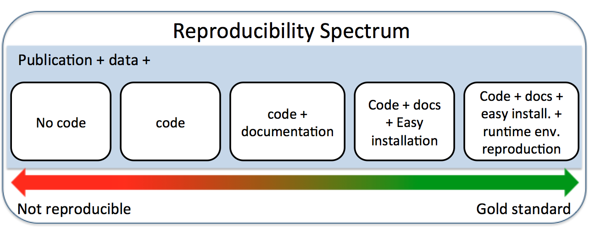
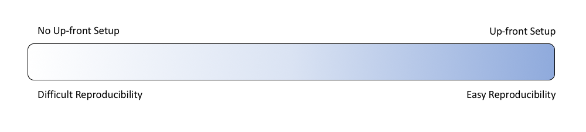

## Welcome

::: {.incremental}

- 🗓️ The course will be held online, from 9 am to 12 pm (Berlin time), July 20-23rd.
  - ⏳with pauses every hour!
- 📚Materiales: everything lives here: <http://reproducibility.rocks/>
- ❓Check points (how familiar are you with \_\_\_?)
- 🏃Exercises:
  - Follow along
  - breakout rooms
- 📑Homework + mini reprohack challenges (optional)

:::

------------------------------------------------------------------------

# Day 1

:::: {.columns}

::: {.column width="50%"}

1.  [Introduction](/materials/day1/01-introduction/)
2.  [Project structure](/materials/day1/02-projects/)
3.  [Quarto documents](/materials/day1/03-quarto/)

:::

::: {.column width="50%"}


:::

::::

------------------------------------------------------------------------


<https://the-turing-way.netlify.app/reproducible-research/reproducible-research.html>

------------------------------------------------------------------------



<https://towardsdatascience.com/scientific-data-analysis-pipelines-and-reproducibility-75ff9df5b4c5>

------------------------------------------------------------------------



<https://rviews.rstudio.com/2018/01/18/package-management-for-reproducible-r-code/>

------------------------------------------------------------------------

## Examples

**Good file names**

- `data/raw/madrid-minimum_temperature.csv`

- `scripts/02-compute-mean_temperature.R`

- `analysis/01-madrid-minimum_temperature-descriptive_statistics.Rmd`

------------------------------------------------------------------------

## Exercise

**Come up with good file names and folders for (choose two)**

- a dataset of cats with columns for weight, length, tail length, fur colour(s), fur type and name.

- a script that downloads data from Spotify.

- a scripts that cleans up data.

- a scripts that fits a linear discriminant model and saves it to a file.

- the .Rds file in which that model is stored.

```{r}
#| eval: true
#| echo: false
countdown::countdown(minutes = 3,  
                     color_text = "#008080", 
                     color_running_background = "#008080",  
                     color_running_text = "white")
```

------------------------------------------------------------------------

## Do you use RStudio projects?

😯 What's that?

👍 I'm familiar with them.

👏 I use them sometimes.

❤️ I use them all the time.

**Choose an emoji from Reactions**

------------------------------------------------------------------------

## Does Quarto documents sound familiar to you?

😯 I don't have a clue.

👍 I've heard of it.

👏 I've used it

❤️ I use it all the time.

**Choose an emoji from Reactions**

------------------------------------------------------------------------

## Does YAML sound familiar to you?

😯 I don't have a clue.

👍 I've heard of it.

👏 I can understand it.

❤️ I can write valid yaml most of the time.

**Choose an emoji from Reactions**

------------------------------------------------------------------------

## Does LaTeX sound familiar to you?

😯 I don't have a clue.

👍 I've heard of it.

👏 I've used it, unfortunately.

❤️ I use it all the time, unfortunately.

**Choose an emoji from Reactions**

------------------------------------------------------------------------

# Preparations for day 2:

1.  [Using git and GitHub](/materials/day2/01-git/) ([setup instructions](/materials/day0/#git-and-github))
    - Install git
    - Create GitHub account
    - Configure your system to use RStudio with GitHub
2.  [Creating a research compendium](/materials/day2/02-research-compedia/)

